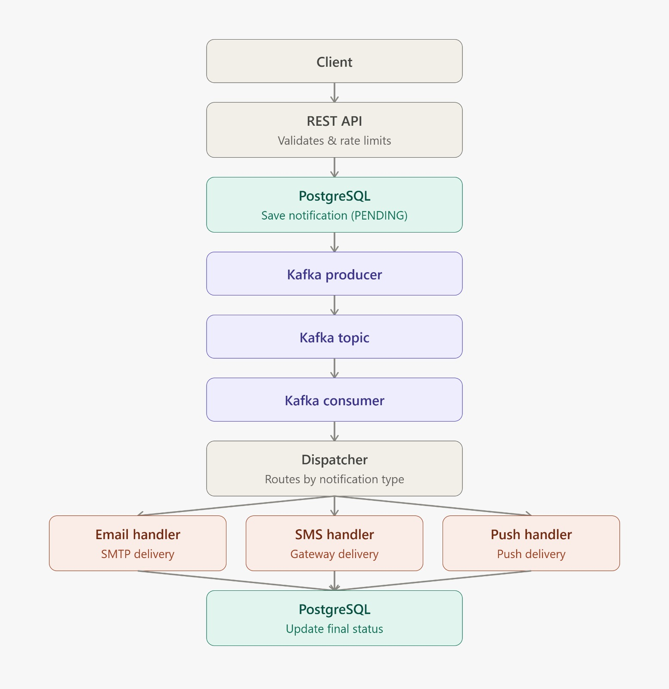
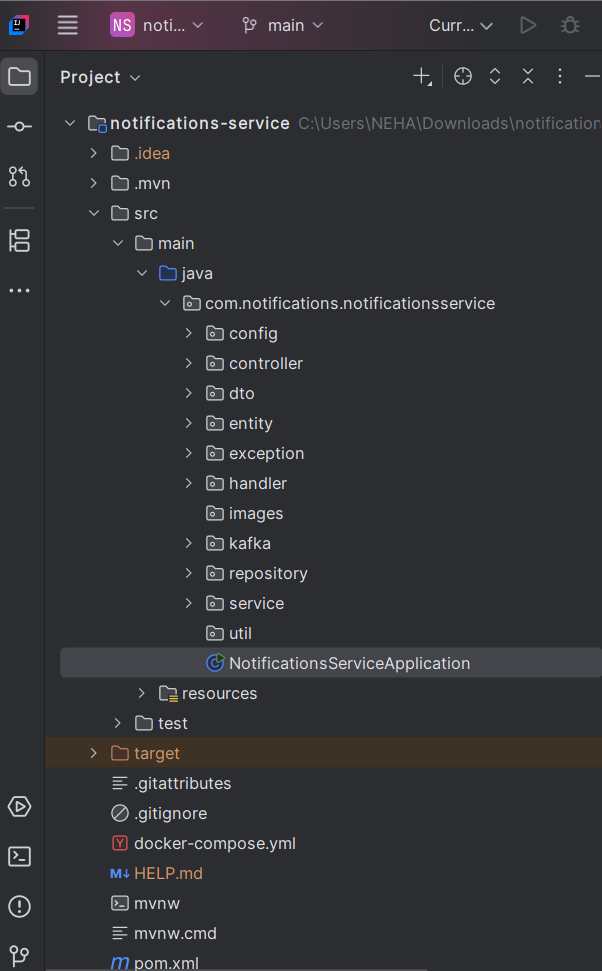
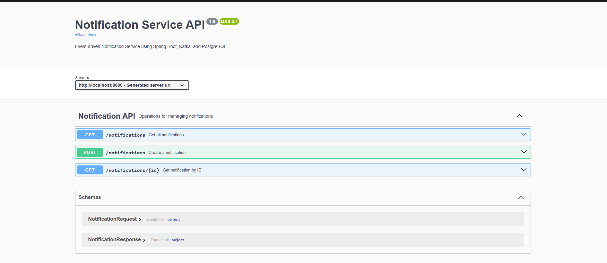

# Event-Driven Notification Service

An asynchronous notification processing system built using **Spring Boot**, **Apache Kafka**, and **PostgreSQL**. The application processes Email, SMS, and Push notifications through an event-driven architecture with retry logic, priority-based processing, rate limiting, structured logging, centralized exception handling, and interactive API documentation using Swagger.

---

## Features

- Asynchronous notification processing using Apache Kafka
- RESTful APIs for creating and retrieving notifications
- Supports multiple notification channels:
    - Email
    - SMS
    - Push
- Notification lifecycle management
    - PENDING
    - DELIVERED
    - FAILED
- Retry mechanism for failed notifications
- Priority-based notification processing
- Strategy Pattern for notification handlers
- Optimized notification dispatcher using `EnumMap`
- Per-user rate limiting
- Structured logging with SLF4J
- Global exception handling with custom exceptions
- Interactive API documentation using Swagger/OpenAPI
- Dockerized PostgreSQL and Kafka environment

---

# Tech Stack

| Technology | Purpose |
|------------|---------|
| Java 17 | Programming Language |
| Spring Boot | Backend Framework |
| Spring Data JPA | ORM |
| PostgreSQL | Relational Database |
| Apache Kafka | Event Streaming |
| Docker | Containerization |
| Maven | Dependency Management |
| Lombok | Boilerplate Reduction |
| Swagger/OpenAPI | API Documentation |
| SLF4J | Logging |

---

# Architecture

The application follows an **event-driven architecture** where notifications are first persisted in PostgreSQL, published to Apache Kafka, consumed asynchronously, dispatched to the appropriate notification handler, and finally updated with their delivery status.

<p align="center">
    
</p>

---

# Project Structure

<p align="center">
    
</p>

---

# Workflow

1. Client sends a notification request.
2. Notification is validated.
3. Rate limiter checks the user's request quota.
4. Notification is saved in PostgreSQL with **PENDING** status.
5. Notification ID is published to Kafka.
6. Kafka Consumer receives the notification.
7. Dispatcher selects the correct notification handler.
8. Email/SMS/Push handler processes the notification.
9. Notification status is updated to:
    - DELIVERED
    - FAILED (after maximum retry attempts)

---

# Notification Lifecycle

```
PENDING
   │
   ▼
Kafka Consumer
   │
   ▼
Processing
   │
   ├────────► DELIVERED
   │
   └────────► FAILED (after retries)
```

---

# Design Patterns Used

### Strategy Pattern

Each notification type has its own implementation.

- EmailNotificationService
- SmsNotificationService
- PushNotificationService

This makes the application easily extensible.

---

### Dispatcher Pattern

A centralized dispatcher routes notifications to the correct handler based on notification type.

---

### Producer–Consumer Pattern

Apache Kafka decouples notification creation from notification processing, enabling asynchronous execution.

---

# Project Structure

```
src
├── main
│   ├── java
│   │   └── com.notifications.notificationsservice
│   │       ├── config
│   │       ├── controller
│   │       ├── dto
│   │       ├── entity
│   │       ├── exception
│   │       ├── handler
│   │       ├── kafka
│   │       │   ├── consumer
│   │       │   └── producer
│   │       ├── repository
│   │       ├── service
│   │       │   ├── notification
│   │       │   └── ratelimit
│   │       └── NotificationsServiceApplication.java
│   └── resources
│       └── application.properties
│
├── docker-compose.yml
├── pom.xml
└── README.md
```

---

# Getting Started

## Prerequisites

- Java 17+
- Maven
- Docker Desktop

---

## Clone Repository

```bash
git clone https://github.com/<your-github-username>/notifications-service.git

cd notifications-service
```

---

## Start Docker Containers

```bash
docker compose up -d
```

---

## Run Application

```bash
mvn spring-boot:run
```

Application starts at:

```
http://localhost:8080
```

---

# REST API

| Method | Endpoint | Description |
|---------|----------|-------------|
| POST | /notifications | Create Notification |
| GET | /notifications | Get All Notifications |
| GET | /notifications/{id} | Get Notification By Id |

---

# Sample Request

```http
POST /notifications
```

```json
{
    "userId": 1,
    "type": "EMAIL",
    "priority": "HIGH",
    "recipient": "test@example.com",
    "message": "Hello Kafka"
}
```

---

# Sample Response

```json
{
    "id": 1,
    "userId": 1,
    "type": "EMAIL",
    "priority": "HIGH",
    "recipient": "test@example.com",
    "message": "Hello Kafka",
    "status": "PENDING"
}
```

---

# Swagger Documentation

Interactive API documentation is available after running the application.

```
http://localhost:8080/swagger-ui/index.html
```

<p align="center">
    
</p>

Using Swagger you can:

- View all REST endpoints
- Execute API requests directly from the browser
- Inspect request and response models
- Explore the generated OpenAPI specification

---

# Exception Handling

The application uses centralized exception handling through `@RestControllerAdvice`.

Custom exceptions include:

- NotificationNotFoundException
- RateLimitExceededException

The API returns meaningful HTTP status codes such as:

- 404 Not Found
- 429 Too Many Requests
- 500 Internal Server Error

---

# Logging

Structured logging is implemented using **SLF4J**.

Logs include:

- Notification creation
- Notification processing
- Retry attempts
- Delivery status
- Rate limit violations
- Error handling

---

# Rate Limiting

Each user is limited to **3 notification requests per minute**.

If the limit is exceeded, the application returns:

```
HTTP 429 - Too Many Requests
```

---

# Retry Mechanism

Failed notifications are retried automatically.

After reaching the maximum retry limit, the notification status is updated to:

```
FAILED
```

---

# Future Improvements

- Redis-based distributed rate limiting
- Dead Letter Queue (DLQ)
- Real Email integration
- SMS Gateway integration
- Push Notification provider integration
- JWT Authentication & Authorization
- Prometheus & Grafana monitoring
- Kubernetes deployment

---

# Author

**Neha Kedar**

Computer Engineering Student

Backend Developer | Java | Spring Boot | Apache Kafka | PostgreSQL

---

## If you found this project useful, consider giving it a ⭐ on GitHub.